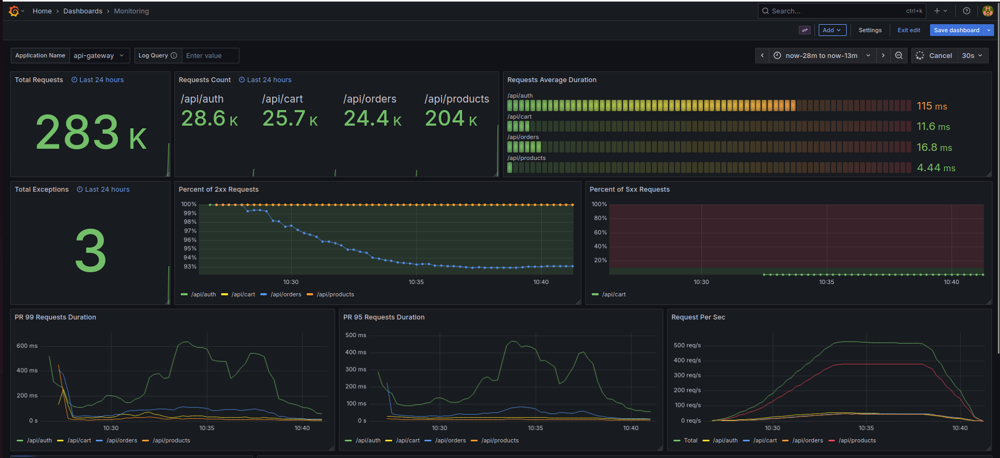

# BrewFlow ☕

Микросервисная платформа интернет-магазина кофе на Spring Boot. Pet-проект для изучения и практики микросервисной архитектуры, event-driven подхода и современного стека технологий.


## Архитектура

Система состоит из 5 микросервисов и полноценного инфраструктурного стека:

```
┌─────────────┐
│   Clients   │
└──────┬──────┘
       │
       ▼
┌─────────────────┐
│  API Gateway    │
└────────┬────────┘
         │
    ┌────┴────┬─────────┬──────────┐
    ▼         ▼         ▼          ▼
┌────────┐ ┌────────┐ ┌─────────┐ ┌──────────────┐
│  User  │ │ Order  │ │ Payment │ │ Notification │
│Service │ │Service │ │ Service │ │   Service    │
└────┬───┘ └───┬────┘ └────┬────┘ └──────┬───────┘
     │         │           │             │
     ▼         ▼           ▼             ▼
┌──────────────────────────────────────────────┐
│         Infrastructure Layer                 │
│  PostgreSQL │ Redis │ Kafka │ Observability  │
└──────────────────────────────────────────────┘

```

### Микросервисы

**API Gateway** (Spring Cloud Gateway + WebFlux)
- Единая точка входа для всех клиентских запросов
- JWT-валидация на уровне gateway
- Маршрутизация и обработка запросов

**User Service** (Spring Boot + PostgreSQL)
- Регистрация и аутентификация пользователей
- Генерация и валидация JWT токенов
- Профили пользователей

**Order Service** (Spring Boot + PostgreSQL + Redis)
- Управление каталогом продуктов
- Корзина покупок
- Создание и обработка заказов
- Интеграция с User и Payment сервисами
- Кэширование через Redis

**Payment Service** (Spring Boot + Kafka)
- Обработка платежей
- Публикация событий об успешных транзакциях в Kafka

**Notification Service** (Spring Boot + Kafka + SMTP)
- Асинхронная обработка событий из Kafka
- Отправка email-уведомлений пользователям

## Технологический стек

**Backend:**
- Java 17
- Spring Boot 3.5
- Spring Cloud Gateway
- Spring Security + JWT
- Spring Data JPA
- MapStruct
- Flyway

**Infrastructure:**
- PostgreSQL (основное хранилище)
- Redis (кэширование)
- Apache Kafka (асинхронная коммуникация)
- Docker + Docker Compose
- Kubernetes + Helm

**Observability:**
- Prometheus
- Grafana
- Tempo
- Loki + Promtail
- Micrometer

## Основные возможности

### Микросервисная архитектура
- Database per Service — изоляция данных на уровне сервисов
- Event-Driven Communication — асинхронность через Kafka
- API Gateway Pattern — централизованный роутинг
- Circuit Breaker — защита от каскадных сбоев
- Distributed Tracing с correlation ID
- Structured Logging с MDC
- Prometheus метрики
- Database migrations (Flyway)
- Health checks для Kubernetes

## Быстрый старт

### Требования
- JDK 17+
- Docker & Docker Compose
- Maven 3.6+

### Локальный запуск

```bash
# Клонировать репозиторий
git clone https://github.com/yourusername/brewflow.git
cd brewflow

# Собрать проект
make build

# Запустить сервисы
make up
```

### Деплой в Kubernetes

```bash
# Собрать сервисы в k8s. Для minikube: eval $(minikube -p minikube docker-env) && make build

# Установить сервисы
make k8s-deploy

# Проверить статус
make k8s-status
```

## Roadmap

### В процессе
- [ ] **Тестирование** — unit, integration и contract тесты с Testcontainers
- [ ] **Pagination** — для всех списковых эндпоинтов
- [ ] **Расширенное кэширование** — активное использование Redis с TTL

### Планируется
- [ ] **Rate Limiting** — защита от перегрузки на уровне Gateway
- [ ] **Outbox Pattern** — гарантированная доставка событий в Kafka
- [ ] **Idempotency Keys** — для критичных операций
- [ ] **Async Communication** — замена синхронных HTTP-вызовов на события
- [ ] **CI/CD Pipeline** — автоматизация тестирования и деплоя

## Известные ограничения

Проект находится в стадии разработки. Текущие ограничения:

- Недостаточное покрытие тестами
- Эндпоинты без пагинации
- Синхронное общение между order-service и user-service

Все эти моменты в планах на улучшение.

## Ручное тестирование

В папке tests находится файл k6-test.js для проведения нагрузочного тестирования с помощью k6.
Для тестирования в postman прикрепил коллекции user-service.json, order-service.json
<details>
  <summary>Скриншот результатов нагрузочного тестирования</summary>


*На системе c Intel i5-14600K и 24 гб ОЗУ получил данные результаты*
  </details>


